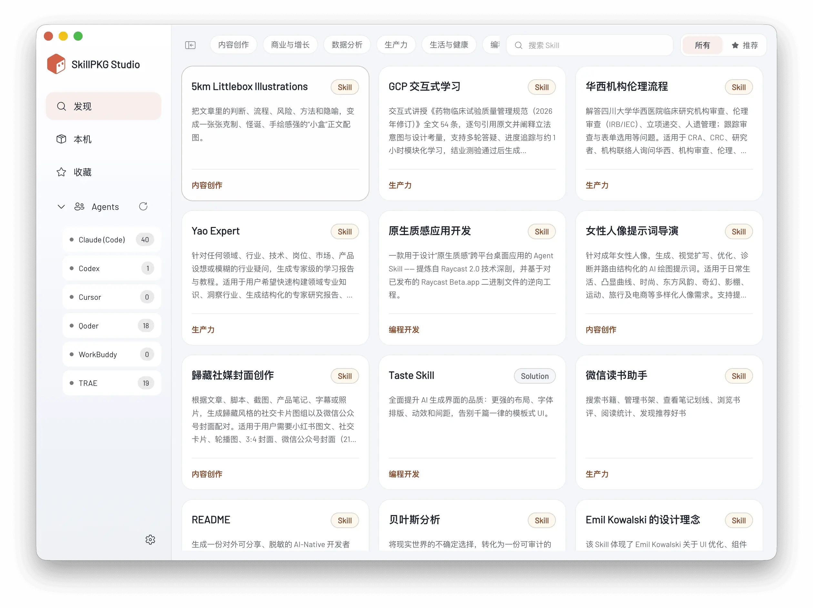

<div style="text-align: center;">
<h1>SkillPKG Studio</h1>



SkillPKG Studio 是一个用于发现、导入、管理和安装 AI Agent Skills 的桌面应用。它把分散在不同工具目录里的 Skill 统一收纳到本机 Skill 库，再按需分发给 Claude Code、Codex、Cursor、Qoder、CodeBuddy、WorkBuddy、TRAE 等 Agent。

项目采用 Electron + React 构建，面向 macOS、Windows 和 Linux 桌面环境。

</div>

## 项目目的

不同 AI 编程工具和 Agent 正在逐渐支持 Skills，但每个工具的 Skill 目录、安装方式、迁移方式都不完全相同。手动维护这些目录会带来几个常见问题：

- 同一个 Skill 要在多个 Agent 里重复复制。
- 不知道某个 Skill 已经装到了哪些工具里。
- 本地 Skill、线上 Skill、压缩包和 Git 仓库来源混在一起，缺少统一入口。
- 想整理、迁移、备份时，需要自己处理文件路径、冲突和历史记录。

SkillPKG Studio 的目标是把这些工作集中到一个可视化应用里：用户只需要维护一个本地 Skill 库，再选择把哪些 Skill 安装到哪些 Agent。

## 工作原理

SkillPKG Studio 以 `SKILL.md` 作为识别 Skill 的核心约定。一个有效 Skill 通常是一个包含 `SKILL.md` 的目录，`SKILL.md` 可以通过 frontmatter 或正文标题提供名称、描述、版本等元信息。

应用内部主要做四件事：

1. 从 SkillPKG 服务、Git 仓库、ZIP 文件或本地目录中发现可用 Skill。
2. 将 Skill 导入到统一的本机 Skill 库。
3. 通过符号链接或目录托管方式，把本机 Skill 库中的 Skill 安装到目标 Agent 的 skills 目录。
4. 使用本地 SQLite 数据库记录安装关系、收藏、应用状态，并支持备份和恢复。

这种设计让 Skill 的真实内容只有一份，多个 Agent 可以共享同一个来源。需要更新或整理时，也优先在本机 Skill 库中完成。

## 主要功能

- 发现 Skill：通过 SkillPKG API 浏览分类、搜索 Skill、查看详情并下载。
- 本机 Skill 库：集中查看、编辑、删除、收藏和打开本地 Skill。
- 多 Agent 管理：自动检测已安装 Agent，查看每个 Agent 当前拥有的 Skill。
- 一键安装：把同一个 Skill 安装到一个或多个 Agent。
- 导入来源：支持从 ZIP 包或 Git 地址扫描并导入包含 `SKILL.md` 的 Skill。
- 本地整理：把散落在 Agent 目录中的非托管 Skill 收纳回本机 Skill 库。
- 数据管理：内置 SQLite 数据库，支持查看位置、备份和恢复。
- 自动更新：桌面应用可通过发布通道检查、下载并安装新版本。

## 项目优势

- 统一管理：不用在多个隐藏目录之间来回查找和复制 Skill。
- 多工具复用：一个 Skill 可以服务多个 Agent，降低重复维护成本。
- 本地优先：Skill 内容和安装记录保存在本机，适合长期积累个人或团队工作流。
- 可追溯：安装关系、收藏和版本描述都有记录，知道每个 Skill 被装到了哪里。
- 兼容现有习惯：保留 Agent 原生 skills 目录结构，不强行改变工具的运行方式。
- 更适合团队沉淀：可以从 Git 或 ZIP 导入，也可以从 SkillPKG 分发，方便团队共享标准能力包。

## 快速使用

1. 打开 SkillPKG Studio。
2. 在设置页配置本机 Skill 存放路径；如果需要访问 SkillPKG 服务，填写 SkillPKG API Key。
3. 在“发现”页搜索并下载 Skill，或在“本机”页从 ZIP/Git 导入 Skill。
4. 在安装弹窗中选择目标 Agent。
5. 到对应 Agent 中使用已安装的 Skill。

## 技术栈

- 桌面运行时：Electron
- 前端框架：React 19、React Router
- 构建工具：Create React App + CRACO
- 样式与组件：CSS、Radix UI、Fluent UI Icons、lucide-react、少量 shadcn 风格组件
- 本地数据库：sql.js SQLite
- 打包发布：electron-builder
- 测试：Jest、Testing Library

## 架构概览

项目分为三层：

- Renderer：React 前端界面，负责路由、状态、列表展示、编辑器、弹窗和用户交互。
- Preload：通过 `contextBridge` 暴露安全的 `window.skillpkg` API，避免前端直接访问 Node.js 能力。
- Main Process：Electron 主进程，负责文件系统、数据库、Agent 检测、Skill 导入、符号链接、应用更新和 IPC 处理。

简化流程如下：

```text
React 页面
  ↓ window.skillpkg.*
preload.js
  ↓ ipcRenderer.invoke(...)
main.js
  ↓
electron/*.js 服务模块
  ↓
本机文件系统 / SQLite / SkillPKG API / electron-updater
```

## 目录结构

```text
.
├── main.js                         # Electron 主进程入口与 IPC 注册
├── preload.js                      # Renderer 可访问的安全 API 桥
├── electron/                       # 主进程服务模块
│   ├── agentCatalog.js             # 支持的 Agent 及其路径配置
│   ├── agentService.js             # Agent Skill 安装、卸载、托管与链接
│   ├── importService.js            # ZIP/Git/SkillPKG 导入与候选扫描
│   ├── installPathService.js       # Skill 库路径迁移与冲突处理
│   ├── skillScanner.js             # Skill 目录扫描与 SKILL.md 元数据解析
│   ├── skillpkgApi.js              # SkillPKG API 客户端
│   └── updateService.js            # 应用更新状态与下载安装
├── src/                            # React 前端
│   ├── AppContext.tsx              # 全局状态、业务动作与页面共享逻辑
│   ├── routes.tsx                  # 路由与菜单配置
│   ├── pages/                      # 发现、本机、收藏、Agents、设置等页面
│   ├── components/                 # 通用组件与业务弹窗
│   ├── config/                     # 前端 Agent 与发现页配置
│   ├── types/                      # 共享类型定义
│   └── utils/                      # Skill 校验、迁移等工具函数
├── scripts/                        # 构建与打包脚本
├── assets/                         # 图标、字体等桌面应用资源
├── public/                         # 前端静态资源
├── BUILD.md                        # 发布与签名说明
└── electron-builder.config.cjs     # electron-builder 打包配置
```

## 本地开发

建议使用项目声明的 Node.js 版本：

```bash
npm install
npm run dev
```

`npm run dev` 会同时启动 React 开发服务和 Electron 应用。

常用命令：

```bash
npm start                         # 只启动 React 开发服务
npm test -- --watchAll=false      # 运行测试
npm run build                     # 构建前端产物
npm run dist                      # 打包当前平台桌面应用
npm run dist:mac                  # 打包 macOS
npm run dist:win                  # 打包 Windows
npm run dist:linux                # 打包 Linux
```

## Skill 约定

一个 Skill 至少需要包含：

```text
my-skill/
└── SKILL.md
```

推荐在 `SKILL.md` 顶部写入元信息：

```markdown
---
name: My Skill
description: 这个 Skill 的用途说明
version: 0.1.0
---

# My Skill
```

扫描器会优先读取 `SKILL.md` 的 frontmatter；如果缺少 `name`，会尝试使用一级标题；如果缺少描述或版本，会使用默认值。

## 贡献方向

欢迎围绕以下方向贡献：

- 新 Agent 适配：在前后端 Agent catalog 中补充新的 Agent 标识、名称和 skills 路径。
- Skill 导入体验：改进 Git、ZIP、本地目录的扫描、冲突提示和批量导入流程。
- Skill 编辑能力：增强文件预览、Markdown 编辑、图片和大文件处理。
- 数据可靠性：完善 SQLite 备份恢复、迁移、安装记录一致性校验。
- 跨平台兼容：改进 Windows、Linux、macOS 下的路径、符号链接、权限和打包行为。
- 测试覆盖：为主进程服务、扫描器、导入逻辑和前端关键交互补充测试。
- 文档与示例：补充 Skill 编写规范、示例 Skill、常见问题和发布说明。

## 贡献流程

1. Fork 本仓库并创建特性分支。
2. 安装依赖并确认本地应用可以启动。
3. 保持改动聚焦，优先遵循现有代码风格和模块边界。
4. 为有风险的逻辑补充或更新测试。
5. 提交前运行：

```bash
npm test -- --watchAll=false
npm run build
```

6. 提交 Pull Request，说明问题背景、改动内容、验证方式和潜在影响。

## 开发注意事项

- Renderer 不应直接访问 Node.js API；需要主进程能力时，请通过 `preload.js` 暴露受控接口。
- 文件系统操作要放在 `electron/` 服务模块中，并注意路径穿越、符号链接和冲突目录。
- 对外部输入的路径、Git 地址、ZIP 内容和 Skill ID 都要做校验。
- 安装到 Agent 时要区分“受 SkillPKG Studio 管理的链接”和用户手动放置的目录，避免误删用户数据。
- 新增 Agent 时需要同时更新 `electron/agentCatalog.js` 和 `src/config/agents.ts`。
- 发布和签名流程请参考 `BUILD.md`。

## 开源协议

本项目以 Apache License 2.0 开源。贡献代码即表示你同意按照 Apache-2.0 协议授权你的贡献。

如果仓库根目录尚未包含 `LICENSE` 文件，请在发布正式开源版本前补充 Apache License 2.0 的完整协议文本。
